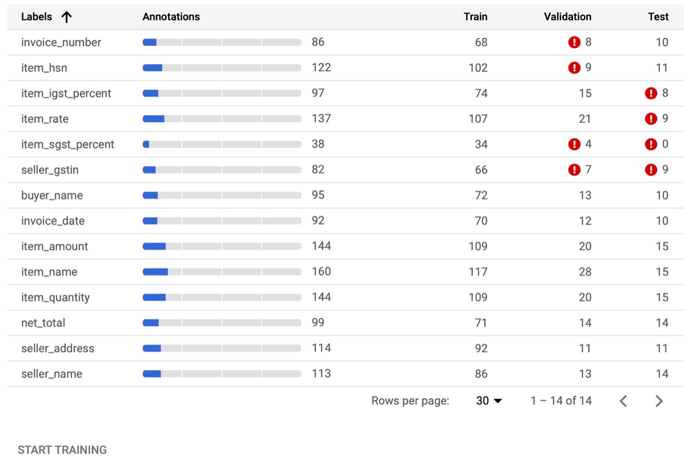

# Flipkart Grid
Automation for Invoice Processing using Google AutoML

## Table of Contents
* [General Info](#general-info)
* [Problem Statement](#problem-statement)
* [Our Solution](#our-solution) 
* [Technologies](#technologies)
* [Specifications](#specifications)
* [Architecture](#architecture)
* [Limitations](#limitations)
* [Installation](#installation)

## General Info

Team Name : Code2XL
Members: [SK Shahnawaz](https://github.com/skshahnawaz), [Rahul Shaikh](https://github.com/Rahul-Shaikh), [Swadesh Jana](https://github.com/Swadesh13)
Institute Name: Jadavpur University

## Problem Statement

##### Electronic Invoicing Using Image Processing:
Parties involved in any transfer of goods or service agree to a fixed rate & period by which the transaction will be paid - The transaction is underlined with the document "Invoice". Traditional ERPs support this transaction through provision of a data entry console for the Operations team to scan a printed invoice and record them. This process is time-consuming, error-prone & archaic.
The aim is to evaluate how to make an intelligent system to perform recording of supplier invoices without human intervention - so that accounting & payment on the same day of goods receipt is possible. The capability referred to as Electronic invoicing - should be agnostic of partner formats, templates & should be able to scale to high volumes with high accuracy.

## Our Solution

This tool can identify information and parse the data from a huge range of invoices, irrespective of template or style. The Model powering this tool is self-learning (Reinforcement) in nature. With every extraction and/or processing, it re-tunes the hyperparameters for better recognition. Can extract even the smallest and lightest of texts. Can be extended to process Receipts and other documents as well. Batch processing is also facilitated.

## Technologies

The Technologies used for this tool are :-

Google Cloud Storage – for storing invoices in bucket
Google AutoML Natural Language – For custom entity extraction model and API serving
App Engine – To trigger document parsing and facilitating API calls

The Following Programming Languages have been used :-
1. Javascript
2. Python

## Specifications

We are using a 10 GB (free-tier) auto-scalable Cloud Storage Bucket to store the invoices in a structured manner once user uploads the images from the SAAS Application he/she prefers. Then Cloud AutoML is initiated to run a prediction job using a pre-trained model through a API. The results are analyzed and after it passes the minimum accuracy threshold, the recognized information is sent to App Engine web application which then parses the information and presents in user readable format.

## Architecture

## Limitations

* Not enough data for labelling and thus all information cannot be extracted with the help of Auto ML. 
  

## Usage

###### Clone
>Clone this repository:
```
$ git clone https://github.com/skshahnawaz/flipkart-grid.git
```

###### Prerequisities
#
* Install Python 3.8 from [here](https://www.python.org/downloads/)
* Install node 12.18.* (including npm 6.14.*) from here [here](https://nodejs.org/en/download/)

###### Dependencies
>Install all dependencies
```
$ pip3 install -r requirements.txt
$ npm i
```

###### Usage
```
$ node predict_now.js
```

## How to Contribute
---

1. Clone repo and create a new branch: `$ git checkout https://github.com/skshahnawaz/flipkart-grid.git -b name_for_new_branch`.
2. Make changes and test
3. Submit Pull Request with comprehensive description of changes